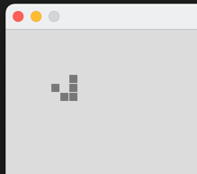
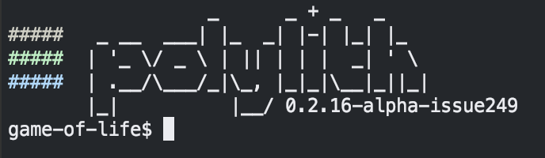
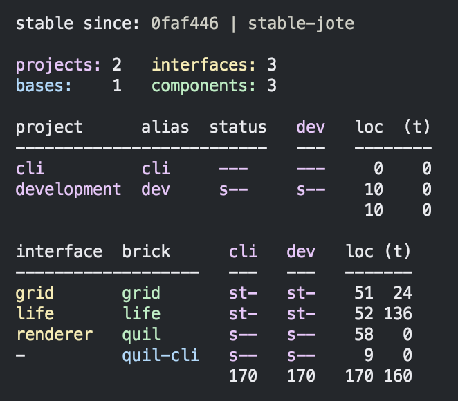

# Game of life

This is [Game of life](https://en.wikipedia.org/wiki/Conway%27s_Game_of_Life) 
implemented in [Clojure](https://clojure.org),
using the [Polylith](https://polylith.gitbook.io/polylith) architecture,
and rendered by [Quil](https://github.com/quil/quil).

The program simply animates a [glider](https://conwaylife.com/wiki/Glider):



### Prerequisites
- git (https://git-scm.com/book/en/v2/Getting-Started-Installing-Git)
- clj (https://clojure.org/guides/install_clojure)

### Clone + start
```
$ git clone git@github.com:tengstrand/game-of-life.git
$ cd game-of-life
$ clj -M:quil
```

### The poly tool ###
If you want to experiment with the poly tool, start a poly shell:

```
$ clj -M:poly
```



And then type `info :loc`:



As you can see, the number of lines of code is 170 + 160 lines of test code.

The poly tool documentation can be found [here](https://polylith.gitbook.io/poly).
The list of available commands can be shown by typing `help` from the poly shell.
